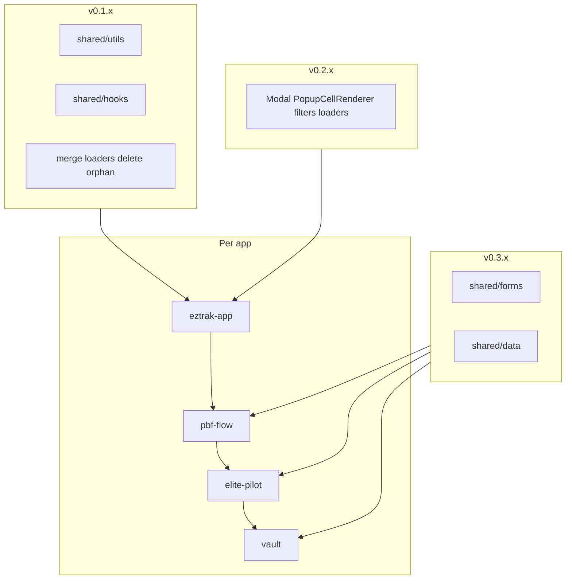

# Eztrak NPM extraction — full plan (from CSV + publish guide)

Source inventory: `[D:\office\eztrak-app\Duplicate Components Report.csv](D:\office\eztrak-app/Duplicate%20Components%20Report.csv)`

Apps referenced in CSV: **main-app** (= eztrak-app), **elite-pilot**, **pbf-flow**, **vault**

Strategy: **eztrak-app first**, package API designed for all CSV tiers; roll out to other apps one PR at a time.

---

## 1. Package architecture (final)

Do **not** create `@eztrak/ui`, `@eztrak/hooks`, `@eztrak/utils` as separate published packages initially. Use **two packages**:


| Package           | npm name         | Responsibility                                                                |
| ----------------- | ---------------- | ----------------------------------------------------------------------------- |
| Design primitives | `eztrak-ui`      | Already on npm `^0.0.32` — Button, Card, Header, Sidebar, Breadcrumbs, Loader |
| Shared app UI     | `@eztrak/shared` | Utils, hooks, CRUD UI, forms, tables — subpath exports                        |


Recommended repo layout (new repo or folder under `D:\office\eztrak-packages`):

```text
eztrak-packages/
  package.json                 # npm workspaces: ["packages/*"]
  packages/
    eztrak-ui/                 # move/consolidate existing publish source here
      package.json             # name: "eztrak-ui"
      src/index.ts
    shared/
      package.json             # name: "@eztrak/shared"
      src/
        utils/
        hooks/
        ui/
        forms/                 # phase 3
        data/                  # phase 3
```

### Export catalog (what each package publishes)

#### `eztrak-ui` (existing — extend only if needed)

```ts
export { Button, Card, Header, Sidebar, Breadcrumbs, Loader }
```

**CSV alignment:** Use for primitives; replace duplicate `button.jsx` (elite-pilot, vault) and consolidate `CustomLoader` → `Loader` over time.

#### `@eztrak/shared/utils`


| Export                                                                                                                | Source (canonical copy from eztrak-app)  | CSV / apps          |
| --------------------------------------------------------------------------------------------------------------------- | ---------------------------------------- | ------------------- |
| `cn`                                                                                                                  | `src/utils/cn.js`                        | All apps (implicit) |
| `isEmpty`, `normalizeApiListItems`, `formatDate`, `getApiError`, `truncateText`, `capitalizeText`, `toDateInputValue` | Split from `src/utils/utils.js`          | Portable subset     |
| `formatRecordForFormValues`                                                                                           | `src/utils/formatRecordForFormValues.js` | Form layouts        |


**Not exported:** `getIdentityUrl`, `getClientId`, `loadUserState`, SweetAlert helpers, JWT/OIDC — stay in each app.

#### `@eztrak/shared/hooks`


| Export                 | Source                              | CSV / apps                                      |
| ---------------------- | ----------------------------------- | ----------------------------------------------- |
| `usePaginationUrlSync` | `src/hooks/usePaginationUrlSync.js` | Settings layouts (main-app, elite-pilot, vault) |
| `useGridHeight`        | `src/hooks/useGridHeight.js`        | AgDataTable consumers                           |
| `usePermissions`       | `src/hooks/userPermissions.js`      | **Defer** — Redux/API coupled                   |


#### `@eztrak/shared/ui` (phase 2)


| Export                              | CSV row                                                     | Used in                                                  |
| ----------------------------------- | ----------------------------------------------------------- | -------------------------------------------------------- |
| `Modal`                             | Modal.jsx / modal.jsx                                       | **4 apps**                                               |
| `PopupCellRenderer`                 | PopupCellRenderer / popupCellRenderer (3 paths in main-app) | **4 apps**                                               |
| `SuccessModal`                      | SuccessModal.jsx                                            | **4 apps**                                               |
| `EztrakButton`                      | EztrakButton.jsx                                            | main-app, pbf-flow                                       |
| `InlineLoader`                      | inline-loader.jsx (merge 2 paths first)                     | main-app, pbf-flow, vault                                |
| `CustomLoader`                      | CustomLoader.jsx                                            | main-app, pbf-flow, vault → thin wrap `eztrak-ui` Loader |
| `Spinner`                           | spinner.jsx                                                 | **4 apps**                                               |
| `TableLoader`                       | table-loader.jsx                                            | main-app, pbf-flow, vault                                |
| `SearchField`                       | search-field.jsx                                            | **4 apps**                                               |
| `TabsFilter`                        | tabs-filter.jsx                                             | **4 apps**                                               |
| `DropdownFilter`                    | dropdown-filter.jsx                                         | **4 apps**                                               |
| `ResetFilterButton`                 | reset-filter-button.jsx                                     | **4 apps**                                               |
| `CustomTab`                         | CustomtTab.jsx                                              | **4 apps**                                               |
| `BreadcrumbsX`                      | BreadcrumbsX.jsx                                            | main-app, elite-pilot, vault                             |
| `ColumnsFilters`                    | ColumnsFilters.jsx                                          | main-app, pbf-flow                                       |
| `CrudModal`                         | CrudModal.jsx                                               | main-app, pbf-flow                                       |
| `Tooltip` / `TooltipText`           | tooltip.jsx, tooltip-text.jsx                               | 3 apps                                                   |
| `CardSkeleton`, `DataTableSkeleton` | skelton/*                                                   | 3 apps                                                   |


#### `@eztrak/shared/forms` (phase 3 — highest CSV value, highest risk)


| Export                                          | CSV                                 | Used in                 |
| ----------------------------------------------- | ----------------------------------- | ----------------------- |
| `Form`, `Input`, `ParentWrapper`                | Form.js, Input.js, ParentWrapper.js | **4 apps**              |
| `getInputType`, `checkValidation`, `inputTypes` | form.helper.js                      | **4 apps**              |
| All `form-elements/`* listed in CSV rows 79–104 | AsyncDropdown, Button, CheckBox, …  | **4 apps** for core set |


Peer dependencies: `react`, `react-dom`, `react-select`, `react-datepicker`, `react-number-format`, etc.

#### `@eztrak/shared/data` (phase 3)


| Export                 | CSV                       | Used in               |
| ---------------------- | ------------------------- | --------------------- |
| `AgDataTable`          | AgDataTable / AGDataTable | **4 apps**            |
| `CustomPagination`     | CustomPagination          | **4 apps**            |
| `CustomCellEditor`     | CustomCellEditor          | elite-pilot, pbf-flow |
| `CustomDropdownEditor` | CustomDropdownEditor      | elite-pilot, pbf-flow |
| `CheckboxCellRenderer` | CheckboxCellRenderer      | elite-pilot, vault    |


**AG Grid Enterprise:** document license in package README; lock `ag-grid-`* peer versions across all four apps.

#### Do NOT publish (per CSV — app-specific or low ROI)


| Category           | Examples                                         | Reason                                              |
| ------------------ | ------------------------------------------------ | --------------------------------------------------- |
| Wall chart         | WallChartHeader, HistoryModal, ActionButton      | elite-pilot + vault only, domain-specific           |
| Elite/pilot modals | mto-items-modal, TWRPopModal, packageTwrModal    | 2-app, feature-specific                             |
| Layout shells      | SettingsLayout, DownloadReportLayout, Layout.jsx | Redux + crudMeta + routes; too coupled              |
| Icons pack         | `components/icons/svgs/*`                        | Large asset tree; optional later as `@eztrak/icons` |
| Federation exposes | MainLayout, HeaderLayout, AuthService            | Stay in eztrak-app webpack exposes                  |


---

## 2. CSV-based ranking: migration value vs risk

**Value score** (for prioritization):

- **4 apps** = highest (publish first among UI)
- **3 apps** = high
- **2 apps** = medium (elite-pilot + vault cluster — publish in phase 2b)
- **1 app** = do not npm; delete duplicate locally only

**Risk score:**

- **Low:** no Redux, no env, no AG Enterprise
- **Medium:** UI with framer-motion, tippy, react-icons
- **High:** Form system, AgDataTable, SettingsLayout

### Tier A — Publish in v0.1.x (low risk, do first)


| #   | Component (CSV)                                 | Apps     | Risk | Package export         |
| --- | ----------------------------------------------- | -------- | ---- | ---------------------- |
| 1   | `cn` (not in CSV but universal)                 | 4        | Low  | `@eztrak/shared/utils` |
| 2   | `usePaginationUrlSync`                          | 3+       | Low  | `@eztrak/shared/hooks` |
| 3   | `useGridHeight`                                 | main-app | Low  | `@eztrak/shared/hooks` |
| 4   | Merge `inline-loader` (2 paths)                 | 3        | None | cleanup before npm     |
| 5   | Delete orphan `ag-data-table/popupCellRenderer` | main-app | None | cleanup                |


### Tier B — Publish in v0.2.x (medium risk, 4-app CSV rows)


| #   | Component (CSV)                                                 | Apps | Package export                  |
| --- | --------------------------------------------------------------- | ---- | ------------------------------- |
| 6   | Modal.jsx / modal.jsx                                           | 4    | `@eztrak/shared/ui` → `Modal`   |
| 7   | PopupCellRenderer                                               | 4    | `PopupCellRenderer`             |
| 8   | SuccessModal                                                    | 4    | `SuccessModal`                  |
| 9   | search-field, tabs-filter, dropdown-filter, reset-filter-button | 4    | `filters/`*                     |
| 10  | spinner, inline-loader, table-loader, CustomLoader              | 3–4  | `Spinner`, `InlineLoader`, etc. |
| 11  | CustomtTab                                                      | 4    | `CustomTab`                     |
| 12  | EztrakButton                                                    | 2    | `@eztrak/shared/ui`             |
| 13  | BreadcrumbsX                                                    | 3    | `@eztrak/shared/ui`             |
| 14  | CrudModal, ColumnsFilters                                       | 2–3  | `@eztrak/shared/ui`             |


### Tier C — Publish in v0.3.x (high risk, 4-app CSV — largest dedup)


| #   | Category (CSV)                                                | Apps | Package export         |
| --- | ------------------------------------------------------------- | ---- | ---------------------- |
| 15  | Form.js + Input + ParentWrapper + form-elements (rows 76–104) | 4    | `@eztrak/shared/forms` |
| 16  | AgDataTable + CustomPagination + cell editors (rows 108–113)  | 4    | `@eztrak/shared/data`  |


### Tier D — elite-pilot + vault only (phase 4 or never)

tooltip, popover, progress-bar, wall-chart, ImageViewerModal, folder-card, etc. (~30 CSV rows)

Publish only if a third consumer needs them; otherwise keep in elite-pilot/vault.

### Tier E — in-app only (do not npm)

- SettingsLayout (3 apps) — extract subcomponents into Tier B/C first
- tutorial-popup (main-app, pbf-flow) — optional later
- setting-pages mock CRUD (main-app only) — **retire**, don’t publish




---

## 3. Step-by-step: how to publish on npm

### Prerequisites

- Node.js 18+ and npm 9+
- npm account with access to publish `eztrak-ui` (unscoped) and `@eztrak` scope (create org at [https://www.npmjs.com/org/create](https://www.npmjs.com/org/create))
- Source repo for packages (recommend `D:\office\eztrak-packages` git repo)
- For **private** code: GitHub Packages or Azure Artifacts instead of public npm

### Step 1 — Create the packages workspace

```bash
cd D:\office
mkdir eztrak-packages && cd eztrak-packages
npm init -y
```

Edit root `package.json`:

```json
{
  "name": "eztrak-packages",
  "private": true,
  "workspaces": ["packages/*"]
}
```

```bash
mkdir packages\shared packages\eztrak-ui
cd packages\shared
npm init -y
```

Set `packages/shared/package.json`:

```json
{
  "name": "@eztrak/shared",
  "version": "0.1.0",
  "description": "Shared hooks, utils, and UI for Eztrak federation apps",
  "main": "./dist/index.js",
  "module": "./dist/index.mjs",
  "types": "./dist/index.d.ts",
  "files": ["dist"],
  "sideEffects": false,
  "exports": {
    ".": { "import": "./dist/index.mjs", "require": "./dist/index.js", "types": "./dist/index.d.ts" },
    "./utils": { "import": "./dist/utils/index.mjs", "require": "./dist/utils/index.js", "types": "./dist/utils/index.d.ts" },
    "./hooks": { "import": "./dist/hooks/index.mjs", "require": "./dist/hooks/index.js", "types": "./dist/hooks/index.d.ts" },
    "./ui": { "import": "./dist/ui/index.mjs", "require": "./dist/ui/index.js", "types": "./dist/ui/index.d.ts" }
  },
  "scripts": {
    "build": "tsup",
    "prepublishOnly": "npm run build"
  },
  "peerDependencies": {
    "react": "^18.0.0",
    "react-dom": "^18.0.0"
  },
  "devDependencies": {
    "tsup": "^8.0.0",
    "react": "^18.3.1",
    "react-dom": "^18.2.0"
  },
  "publishConfig": {
    "access": "restricted"
  }
}
```

Use `"access": "public"` only if the package should be public.

### Step 2 — Copy canonical source from eztrak-app

For phase 1, copy into `packages/shared/src/`:

- `eztrak-app/src/utils/cn.js` → `utils/cn.ts` (rename to TS optional)
- `eztrak-app/src/hooks/usePaginationUrlSync.js` → `hooks/usePaginationUrlSync.ts`
- `eztrak-app/src/hooks/useGridHeight.js` → `hooks/useGridHeight.ts`
- Pure functions extracted from `utils/utils.js` → `utils/helpers.ts`

Add `tsup.config.ts`:

```ts
import { defineConfig } from "tsup";

export default defineConfig({
  entry: {
    index: "src/index.ts",
    "utils/index": "src/utils/index.ts",
    "hooks/index": "src/hooks/index.ts",
    "ui/index": "src/ui/index.ts",
  },
  format: ["cjs", "esm"],
  dts: true,
  sourcemap: true,
  clean: true,
  external: ["react", "react-dom", "react-router-dom"],
});
```

Barrel files re-export public API only (do not export internals).

### Step 3 — Authenticate to npm

```bash
npm login
# or for CI: NPM_TOKEN in environment
```

Scoped publish (first time for `@eztrak`):

```bash
npm config set scope @eztrak --location=project
# in packages/shared/.npmrc (if private):
# @eztrak:registry=https://registry.npmjs.org/
# //registry.npmjs.org/:_authToken=${NPM_TOKEN}
```

### Step 4 — Build and dry-run

```bash
cd D:\office\eztrak-packages\packages\shared
npm install
npm run build
npm pack
# inspect eztrak-shared-0.1.0.tgz contents
```

Verify `package.json` `files` only includes `dist/` (no secrets, no `.env`).

### Step 5 — Publish first version

```bash
npm publish --access restricted
# public: npm publish --access public
```

For `eztrak-ui` bumps (existing package):

```bash
cd packages/eztrak-ui
npm version patch
npm publish
```

### Step 6 — Consume in eztrak-app

```bash
cd D:\office\eztrak-app
npm install @eztrak/shared@0.1.0
```

Replace imports:

```js
// before
import { cn } from "../../utils/cn";
// after
import { cn } from "@eztrak/shared/utils";
```

Run app: `npm start` — smoke-test Settings and any grid page.

### Step 7 — Versioning rules (semver)


| Change                          | Bump                    |
| ------------------------------- | ----------------------- |
| Bugfix, no API change           | `patch` (0.1.0 → 0.1.1) |
| New export, backward compatible | `minor` (0.1.0 → 0.2.0) |
| Renamed prop, removed export    | `major` (0.x → 1.0.0)   |


Pin exact version in all four apps during rollout:

```json
"@eztrak/shared": "0.2.3"
```

Not `^0.2.3` until all apps are migrated.

### Step 8 — Roll out to other apps (CSV order)

Per app, per phase:

1. `npm install @eztrak/shared@x.y.z`
2. Replace imports (grep local path → package path)
3. Delete local duplicate file
4. `npm start` / QA checklist for that app
5. PR + pin same version in other apps’ `package.json`

Suggested order: **eztrak-app → pbf-flow → vault → elite-pilot** (pbf-flow shares many 4-app CSV rows with main-app).

### Step 9 — CI publish (recommended)

GitHub Actions example (on tag `shared-v`*):

```yaml
- run: npm ci
  working-directory: packages/shared
- run: npm run build
  working-directory: packages/shared
- run: npm publish
  working-directory: packages/shared
  env:
    NODE_AUTH_TOKEN: ${{ secrets.NPM_TOKEN }}
```

Tag workflow: `git tag shared-v0.2.0 && git push origin shared-v0.2.0`

### Step 10 — Module Federation note

Do **not** add `@eztrak/shared` to webpack `exposes`. Add to `shared` singleton block only if duplicate React issues appear:

```js
shared: {
  ...deps,
  "@eztrak/shared": { singleton: true, requiredVersion: deps["@eztrak/shared"] },
  react: { singleton: true, requiredVersion: deps.react },
}
```

Usually normal `import` from `node_modules` is enough.

---

## 4. Per-phase migration checklist (eztrak-app)

### Phase 1 — v0.1.0 (`utils` + `hooks`)

- Create `eztrak-packages` workspace
- Copy `cn`, hooks, pure utils
- Publish `@eztrak/shared@0.1.0`
- Update imports in eztrak-app (~19 cn consumers, 6 hook consumers)
- Merge `inline-loader.jsx` duplicates locally
- Delete `ag-data-table/popupCellRenderer.jsx` (orphan)
- QA: SettingsLayout pagination URL, any AgDataTable page

### Phase 2 — v0.2.0 (`ui` — CSV 4-app tier)

- Copy Modal, PopupCellRenderer, SuccessModal, filters, loaders, CustomTab
- Add peers: `framer-motion`, `@tippyjs/react`, `react-icons`, `eztrak-ui`
- Publish `@eztrak/shared@0.2.0`
- Migrate eztrak-app; delete local copies
- Migrate pbf-flow (Modal, PopupCellRenderer, filters, Form consumers that only need ui)
- Migrate vault + elite-pilot for same subset

### Phase 3 — v0.3.0 (`forms` + `data` — CSV rows 76–113)

- Document AG Grid Enterprise peer versions in README
- Copy Form system + AgDataTable from eztrak-app (canonical)
- Inject RTK/API via props or context adapters (no hardcoded `generalApi` in package)
- Publish `@eztrak/shared@0.3.0`
- Migrate all 4 apps; remove 30+ duplicate form-element files per app

### Phase 4 — optional (`elite-pilot`/`vault` UI)

- Evaluate Tier D CSV rows by actual import count
- Publish subpath `@eztrak/shared/ui-extended` only if ≥3 apps need them

---

## 5. What stays in each app


| Keep local                           | Why                               |
| ------------------------------------ | --------------------------------- |
| `assets/crudMeta/*`, routes          | App-specific business config      |
| `redux/*`, `services/AuthService`    | App state + OIDC                  |
| `SettingsLayout.jsx`                 | Until CRUD shell is parameterized |
| `setting-pages/*`                    | Deprecate; not npm                |
| Env helpers in `utils.js`            | Security / build-time env         |
| webpack `exposes` (MainLayout, etc.) | Federation contract               |


---

## 6. Success metrics


| Milestone     | Target                                                                                   |
| ------------- | ---------------------------------------------------------------------------------------- |
| v0.1.0 live   | eztrak-app on `@eztrak/shared/utils` + `/hooks`; 0 local `cn` imports                    |
| v0.2.0 live   | 4 apps on shared Modal + PopupCellRenderer + filters (CSV rows 27–49)                    |
| v0.3.0 live   | 4 apps on shared Form + AgDataTable (CSV rows 76–113); ~100+ fewer duplicate files total |
| Lines removed | Estimate 15–25k duplicated LOC across 4 apps after phase 3                               |


---

## 7. Quick reference — CSV → npm export map


| CSV section                                                | Phase     | npm location                               |
| ---------------------------------------------------------- | --------- | ------------------------------------------ |
| UI rows with 4 apps (filters, Modal, Popup, loaders, tabs) | 2         | `@eztrak/shared/ui`                        |
| UI rows with 3 apps (BreadcrumbsX, skeletons)              | 2         | `@eztrak/shared/ui`                        |
| UI rows elite-pilot + vault only                           | 4 or skip | `@eztrak/shared/ui-extended` or keep local |
| Form Controls (all 4 apps)                                 | 3         | `@eztrak/shared/forms`                     |
| Table Wrappers (all 4 apps)                                | 3         | `@eztrak/shared/data`                      |
| Layout Wrappers                                            | —         | Stay in apps                               |
| spinner → prefer `eztrak-ui` Loader long-term              | 1–2       | `eztrak-ui` + thin wrappers in shared      |


---

## 8. Step-by-step: where to put each file (code placement guide)

This section answers: **which source file goes where in the npm repo**, what **new files** you create, and what **changes** in each consuming app.

### 8.1 Where the npm repo lives

Create a **separate git repo** (recommended):

```text
D:\office\eztrak-packages\          ← NEW repo (publish from here)
D:\office\eztrak-app\               ← consumer (main-app) — keep as-is until migration
D:\office\pbf-flow\                 ← consumer
D:\office\elite-pilot\              ← consumer
D:\office\vault\                    ← consumer
```

Do **not** put publishable code inside `eztrak-app/src/` long-term. Copy **from** eztrak-app **into** `eztrak-packages`, then delete local copies in each app after migration.

**Canonical source rule:** always copy from **eztrak-app** first (main-app in CSV). Other apps delete their copies after switching imports.

---

### 8.2 Full folder tree (what you create)

```text
D:\office\eztrak-packages\
├── .gitignore
├── .npmrc                          # optional: @eztrak scope auth
├── package.json                    # workspaces root (private: true)
├── README.md
└── packages/
    ├── eztrak-ui/                  # existing npm package source (if you have it)
    │   ├── package.json
    │   ├── tsup.config.ts
    │   └── src/
    │       └── index.ts
    └── shared/                     # @eztrak/shared
        ├── package.json
        ├── tsup.config.ts
        ├── README.md
        └── src/
            ├── index.ts            # re-exports all public API (optional barrel)
            ├── utils/
            │   ├── index.ts        # YOU CREATE — barrel export
            │   ├── cn.ts           # COPY from eztrak-app
            │   └── helpers.ts      # YOU CREATE — split from utils.js
            ├── hooks/
            │   ├── index.ts        # YOU CREATE — barrel export
            │   ├── usePaginationUrlSync.ts
            │   └── useGridHeight.ts
            ├── ui/                 # Phase 2
            │   ├── index.ts
            │   ├── Modal.tsx
            │   ├── PopupCellRenderer.tsx
            │   ├── SuccessModal.tsx
            │   ├── EztrakButton.tsx
            │   ├── InlineLoader.tsx
            │   ├── CustomLoader.tsx
            │   ├── Spinner.tsx
            │   ├── TableLoader.tsx
            │   ├── CustomTab.tsx
            │   ├── BreadcrumbsX.tsx
            │   ├── CrudModal.tsx
            │   ├── ColumnsFilters.tsx
            │   ├── assets/
            │   │   └── threeDotIcon.svg   # MOVE from eztrak-app (PopupCellRenderer uses it)
            │   └── filters/
            │       ├── index.ts
            │       ├── SearchField.tsx
            │       ├── TabsFilter.tsx
            │       ├── DropdownFilter.tsx
            │       └── ResetFilterButton.tsx
            ├── forms/              # Phase 3
            │   ├── index.ts
            │   ├── Form.tsx
            │   ├── Input.tsx
            │   ├── ParentWrapper.tsx
            │   ├── form.helper.ts
            │   └── form-elements/  # COPY entire folder from eztrak-app
            └── data/                 # Phase 3
                ├── index.ts
                ├── AgDataTable.tsx
                ├── CustomPagination.tsx
                ├── CustomCellEditor.tsx
                ├── CustomDropdownEditor.tsx
                └── CheckboxCellRenderer.tsx
```

---

### 8.3 Phase 1 — file-by-file copy map (v0.1.0)

| Step | Action | Source (eztrak-app) | Destination (eztrak-packages) | Edits when copying |
|------|--------|---------------------|-------------------------------|-------------------|
| 1 | COPY | `src/utils/cn.js` | `packages/shared/src/utils/cn.ts` | Rename optional; keep logic identical |
| 2 | CREATE | — | `packages/shared/src/utils/helpers.ts` | Copy only pure functions from `src/utils/utils.js` (see list in §1) |
| 3 | CREATE | — | `packages/shared/src/utils/index.ts` | `export { cn } from './cn'; export * from './helpers';` |
| 4 | COPY | `src/hooks/usePaginationUrlSync.js` | `packages/shared/src/hooks/usePaginationUrlSync.ts` | No logic changes |
| 5 | COPY | `src/hooks/useGridHeight.js` | `packages/shared/src/hooks/useGridHeight.ts` | No logic changes |
| 6 | CREATE | — | `packages/shared/src/hooks/index.ts` | Export both hooks |
| 7 | CREATE | — | `packages/shared/src/index.ts` | `export * from './utils'; export * from './hooks';` |
| 8 | CREATE | — | `packages/shared/package.json` | See §3 in this plan |
| 9 | CREATE | — | `packages/shared/tsup.config.ts` | See §3 in this plan |

**`helpers.ts` — what to paste from `utils.js` (and what to skip):**

```text
INCLUDE:  isEmpty, normalizeApiListItems, formatDate, getApiError, truncateText,
          capitalizeText, toLowerCaseText, toDateInputValue, formatDateTime,
          currencyFormatter, parseCurrencyValueToNumber, flattenTableData,
          getErrorMessages, deserializeJson, convertCommaDataToArray,
          checkIfExistsInArray, getFieldsByCategory, getFieldsByName,
          getFieldsByInputType, removeByPropertyValues

SKIP:     showLogoutConfirmation, handleLogout, getIdentityUrl, getClientId,
          loadUserState, saveUserState, isTokenExpired, extractJWTData,
          confirmationAlert, showDeleteConfirmation (SweetAlert2),
          getPublicPath, isLive, FEATURES, settingstabs
```

**Dependencies to add in `packages/shared/package.json` for phase 1:**

```json
"dependencies": {
  "clsx": "^2.1.1",
  "tailwind-merge": "^3.0.1"
},
"peerDependencies": {
  "react": "^18.0.0",
  "react-dom": "^18.0.0",
  "react-router-dom": "^7.0.0"
}
```

---

### 8.4 Phase 1 — what changes in eztrak-app (consumer)

For **every file** that imported local utils/hooks, update the import path only. Do **not** move app code into the package yet.

| Old import in eztrak-app | New import |
|--------------------------|------------|
| `from "../../utils/cn"` (or any relative path to `cn.js`) | `from "@eztrak/shared/utils"` |
| `from "../../hooks/usePaginationUrlSync"` | `from "@eztrak/shared/hooks"` |
| `from "../../hooks/useGridHeight"` | `from "@eztrak/shared/hooks"` |

**Example — `SettingsLayout.jsx`:**

```js
// BEFORE (local)
import { cn } from "../utils/cn";
import { usePaginationUrlSync } from "../hooks/usePaginationUrlSync";

// AFTER (npm)
import { cn } from "@eztrak/shared/utils";
import { usePaginationUrlSync } from "@eztrak/shared/hooks";
```

**Files in eztrak-app to update in phase 1** (grep for `utils/cn` and `usePaginationUrlSync`):

- `src/layouts/SettingsLayout.jsx`
- `src/layouts/AccessControlLayout.jsx`
- `src/layouts/ProjectPage.jsx`
- `src/layouts/MaterialDescriptionData.jsx`
- `src/pages/VendorSettings.jsx`
- `src/components/ag-data-table/AgDataTable.jsx`
- All other files returned by: `grep -r "utils/cn" src/`

**Files to DELETE in eztrak-app after zero local imports:**

| Delete | Only when |
|--------|-----------|
| `src/utils/cn.js` | No file imports it locally |
| `src/hooks/usePaginationUrlSync.js` | All apps migrated OR re-export shim removed |
| `src/hooks/useGridHeight.js` | Same |

**Optional temporary shim** (helps gradual migration in one app):

```js
// src/utils/cn.js — keep briefly during migration
export { cn } from "@eztrak/shared/utils";
```

**Local cleanup (main-app only, before or with phase 1):**

| Action | Files |
|--------|-------|
| MERGE into one | `src/components/inline-loader.jsx` + `src/components/custom-loader/inline-loader.jsx` → keep one path |
| DELETE orphan | `src/components/ag-data-table/popupCellRenderer.jsx` (never imported) |

---

### 8.5 Phase 2 — file-by-file copy map (v0.2.0 UI)

| Step | Source (eztrak-app) | Destination (@eztrak/shared) | Required edits when copying |
|------|---------------------|------------------------------|----------------------------|
| 1 | `src/components/modals/Modal.jsx` | `src/ui/Modal.tsx` | Change `import { cn } from "../../utils/cn"` → `import { cn } from "../utils/cn"` |
| 2 | `src/components/popupCellRenderer.jsx` | `src/ui/PopupCellRenderer.tsx` | Fix cn import; move SVG asset (step 3) |
| 3 | `src/assets/images/icons/svgs/threeDotIcon.svg` | `src/ui/assets/threeDotIcon.svg` | Update import in PopupCellRenderer |
| 4 | `src/components/SuccessModal.jsx` | `src/ui/SuccessModal.tsx` | Fix relative imports to package paths |
| 5 | `src/components/button/EztrakButton.jsx` | `src/ui/EztrakButton.tsx` | `import { cn } from "../utils/cn"`; keep `import { Button } from "eztrak-ui"` |
| 6 | `src/components/inline-loader.jsx` (merged) | `src/ui/InlineLoader.tsx` | Usually no edits |
| 7 | `src/components/custom-loader/CustomLoader.jsx` | `src/ui/CustomLoader.tsx` | Keep `eztrak-ui` Loader import |
| 8 | `src/components/spinner.jsx` | `src/ui/Spinner.tsx` | — |
| 9 | `src/components/custom-loader/table-loader.jsx` | `src/ui/TableLoader.tsx` | — |
| 10 | `src/components/custom-tabs/CustomtTab.jsx` | `src/ui/CustomTab.tsx` | Rename export to `CustomTab` |
| 11 | `src/components/BreadcrumbsX.jsx` | `src/ui/BreadcrumbsX.tsx` | Still uses `eztrak-ui` Breadcrumbs |
| 12 | `src/components/modals/CrudModal.jsx` | `src/ui/CrudModal.tsx` | Update Modal import to `./Modal` |
| 13 | `src/components/column-filters/ColumnsFilters.jsx` | `src/ui/ColumnsFilters.tsx` | Fix Button import → `./EztrakButton` or `eztrak-ui` |
| 14 | `src/components/search-filters/search-field.jsx` | `src/ui/filters/SearchField.tsx` | cn + react-router-dom imports |
| 15 | `src/components/search-filters/tabs-filter.jsx` | `src/ui/filters/TabsFilter.tsx` | — |
| 16 | `src/components/search-filters/dropdown-filter.jsx` | `src/ui/filters/DropdownFilter.tsx` | — |
| 17 | `src/components/search-filters/reset-filter-button.jsx` | `src/ui/filters/ResetFilterButton.tsx` | — |
| 18 | CREATE | `src/ui/index.ts` | Barrel — see below |
| 19 | CREATE | `src/ui/filters/index.ts` | Re-export all filters |

**`packages/shared/src/ui/index.ts` (you create):**

```ts
export { default as Modal } from "./Modal";
export { default as PopupCellRenderer } from "./PopupCellRenderer";
export { default as SuccessModal } from "./SuccessModal";
export { default as EztrakButton } from "./EztrakButton";
export { default as InlineLoader } from "./InlineLoader";
export { default as CustomLoader } from "./CustomLoader";
export { default as Spinner } from "./Spinner";
export { default as TableLoader } from "./TableLoader";
export { default as CustomTab } from "./CustomTab";
export { default as BreadcrumbsX } from "./BreadcrumbsX";
export { default as CrudModal } from "./CrudModal";
export { default as ColumnsFilters } from "./ColumnsFilters";
export * from "./filters";
```

**Add to `package.json` exports (phase 2):**

```json
"./ui": {
  "import": "./dist/ui/index.mjs",
  "require": "./dist/ui/index.js",
  "types": "./dist/ui/index.d.ts"
}
```

**Add peerDependencies for phase 2:**

```json
"peerDependencies": {
  "eztrak-ui": "^0.0.32",
  "framer-motion": "^11.0.0",
  "@tippyjs/react": "^4.2.0",
  "react-icons": "^5.0.0"
}
```

**SVG in PopupCellRenderer:** if using `@svgr/webpack` in apps but tsup in package, either:

- Option A: copy SVG as React component inside package (`ThreeDotIcon.tsx`), or
- Option B: use `react-icons` only and drop SVG import (simplest)

---

### 8.6 Phase 2 — what changes in each consuming app

**eztrak-app example — `SettingsLayout.jsx`:**

```js
// BEFORE
import Modal from "../components/modals/Modal";
import PopupCellRenderer from "../components/popupCellRenderer";
import SearchField from "../components/search-filters/search-field";

// AFTER
import { Modal, PopupCellRenderer } from "@eztrak/shared/ui";
import { SearchField } from "@eztrak/shared/ui";  // or from "@eztrak/shared/ui/filters" if you add sub-export
```

**Per-app file deletion after migration (CSV "Used in" column):**

| Component | Delete from these apps when imports are zero |
|-----------|---------------------------------------------|
| Modal | main-app, elite-pilot, pbf-flow, vault |
| PopupCellRenderer | all 4 (main-app: delete both `popupCellRenderer.jsx` paths) |
| search-field, tabs-filter, dropdown-filter | all 4 |
| EztrakButton | main-app, pbf-flow |
| inline-loader | main-app, pbf-flow, vault (after merge) |

**Case sensitivity fix:** elite-pilot uses `PopupCellRenderer.jsx`, vault uses `PopupCellRenderer.jsx`, main-app uses `popupCellRenderer.jsx`. After npm, all apps use the same import:

```js
import { PopupCellRenderer } from "@eztrak/shared/ui";
```

---

### 8.7 Phase 3 — file-by-file copy map (forms + data)

#### Forms (`@eztrak/shared/forms`)

| Source (eztrak-app) | Destination |
|---------------------|-------------|
| `src/components/form/Form.js` | `packages/shared/src/forms/Form.tsx` |
| `src/components/form/Input.js` | `packages/shared/src/forms/Input.tsx` |
| `src/components/form/ParentWrapper.js` | `packages/shared/src/forms/ParentWrapper.tsx` |
| `src/components/form/form.helper.js` | `packages/shared/src/forms/form.helper.ts` |
| `src/components/form/form-elements/**` | `packages/shared/src/forms/form-elements/**` (entire folder) |
| `src/components/form/form-elements/utils.js` | same subfolder |

**Critical edits in `form.helper.ts`:**

```js
// BEFORE (app-local)
import { getFieldsByInputType, ... } from "../../utils/utils";

// AFTER (package-internal)
import { getFieldsByInputType, ... } from "../utils/helpers";
```

**Decouple Redux/API:** if any form element imports `generalApi` or `apiConstants`, replace with **props**:

```js
// AsyncDropdown — accept fetch function as prop instead of importing RTK slice
<AsyncDropdown loadOptions={loadOptions} />
```

App passes `loadOptions` from its own `redux/api`.

#### Data (`@eztrak/shared/data`)

| Source (eztrak-app) | Destination |
|---------------------|-------------|
| `src/components/ag-data-table/AgDataTable.jsx` | `packages/shared/src/data/AgDataTable.tsx` |
| `src/components/ag-data-table/AgDataTableHelper.js` | `packages/shared/src/data/AgDataTableHelper.ts` |
| `src/components/ag-data-table/CustomPagination.jsx` | `packages/shared/src/data/CustomPagination.tsx` |
| pbf-flow or elite-pilot `CustomCellEditor.jsx` | `packages/shared/src/data/CustomCellEditor.tsx` (pick best copy) |
| vault `CustomDropdownEditor.jsx` | `packages/shared/src/data/CustomDropdownEditor.tsx` |

**`AgDataTable.tsx` import fixes:**

```js
// BEFORE
import { cn } from "../../utils/cn";
import { useGridHeight } from "../../hooks/useGridHeight";
import PopupCellRenderer from "../popupCellRenderer";

// AFTER (inside package)
import { cn } from "../utils/cn";
import { useGridHeight } from "../hooks/useGridHeight";
import PopupCellRenderer from "../ui/PopupCellRenderer";
```

**Peer deps for phase 3:**

```json
"ag-grid-community": "^33.3.0",
"ag-grid-react": "^33.3.0",
"ag-grid-enterprise": "^33.3.0",
"react-select": "^5.10.0",
"react-datepicker": "^9.1.0"
```

---

### 8.8 Config files — exact contents and location

#### Root `D:\office\eztrak-packages\package.json`

```json
{
  "name": "eztrak-packages",
  "private": true,
  "workspaces": ["packages/*"],
  "scripts": {
    "build": "npm run build --workspaces",
    "build:shared": "npm run build -w @eztrak/shared"
  }
}
```

#### `packages/shared/tsup.config.ts`

```ts
import { defineConfig } from "tsup";

export default defineConfig({
  entry: {
    index: "src/index.ts",
    "utils/index": "src/utils/index.ts",
    "hooks/index": "src/hooks/index.ts",
    "ui/index": "src/ui/index.ts",
    // phase 3:
    // "forms/index": "src/forms/index.ts",
    // "data/index": "src/data/index.ts",
  },
  format: ["cjs", "esm"],
  dts: true,
  sourcemap: true,
  clean: true,
  external: [
    "react",
    "react-dom",
    "react-router-dom",
    "eztrak-ui",
    "framer-motion",
    "@tippyjs/react",
    "react-icons",
    "ag-grid-community",
    "ag-grid-react",
    "ag-grid-enterprise",
  ],
  loader: { ".svg": "text" },
});
```

#### `packages/shared/.gitignore`

```text
dist/
node_modules/
*.tgz
```

---

### 8.9 End-to-end workflow per phase (checklist)

```text
PHASE 1
  1. Create D:\office\eztrak-packages\ tree (§8.2)
  2. Copy utils + hooks files (§8.3)
  3. npm install && npm run build in packages/shared
  4. npm publish → @eztrak/shared@0.1.0
  5. cd D:\office\eztrak-app && npm install @eztrak/shared@0.1.0
  6. Replace imports in all grep hits (§8.4)
  7. Delete src/utils/cn.js + hook files when safe
  8. npm start → test Settings + grids

PHASE 2
  1. Copy UI files into packages/shared/src/ui/ (§8.5)
  2. Fix imports + move threeDotIcon.svg
  3. Add ui entry to tsup.config.ts
  4. npm run build && npm publish → 0.2.0
  5. Update eztrak-app imports (§8.6)
  6. Delete local Modal, PopupCellRenderer, filters, loaders
  7. Repeat steps 5–6 for pbf-flow, vault, elite-pilot

PHASE 3
  1. Copy forms/ and data/ folders (§8.7)
  2. Decouple Redux/API imports
  3. Publish 0.3.0
  4. Migrate all 4 apps; delete form-elements + ag-data-table copies
```

---

### 8.10 What stays where (never move)

| Location | Stays because |
|----------|---------------|
| `eztrak-app/src/assets/crudMeta/*` | Business config per app |
| `eztrak-app/src/navigation/*` | Routes |
| `eztrak-app/src/redux/*` | App state |
| `eztrak-app/src/services/AuthService.js` | OIDC — federated expose |
| `eztrak-app/webpack.config.js` exposes | Module Federation contract |
| `*/src/pages/*`, feature modules | App-specific screens |
| CSV Tier D (elite-pilot + vault only UI) | Keep local unless 3+ apps need it |

---

To **execute** this plan, say: **"execute the plan"** or **"start phase 1"**.